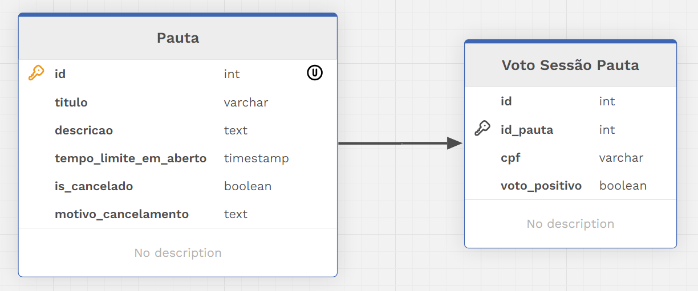

# Decisões Pautas

Sistema para criação de pautas para votação de sim/não para acordos.

## Tecnologias/Framework

- [Swagger](https://swagger.io/) - Para acessar documentação, utilize o link http://localhost:8080/v2/api-docs com o servidor rodando
- [JPA] - A estratégia do gerenciamento das alterações no banco de dados foi "update", onde todas as alterações no código será feita no banco
- [PostgreSQL](https://www.postgresql.org/) - Utilizei banco de dados SQL
- [Postman](https://www.postman.com/) - Utilizei para testar manualmente a aplicação, link para Collection: https://documenter.getpostman.com/view/12044113/2sA3XQi2sc#4d33dc8e-6ffa-45ac-a444-dd130d59b0e4
- [sonarlint](https://www.sonarsource.com/products/sonarlint/) - Sonarlint mantém o código limpo e dimunui chance de erros

## Instalação

- Um database com nome "pautas" deve ser criado no PostgreSQL
- A versão do JDK deve ser maior que 17

## Entidades do banco de dados

### Pauta
Uma Pauta é criada com título e descrição e o tempo em que ele ficará aberto.
A Pauta deve ser iniciada para que a votação seja liberada.
Uma Pauta pode ser cancelada e perderá completamente toda sua funcionalidade.

### Voto Pauta

Cada voto na pauta pelo usuário.

## Futuro
- Adicionar visualização em tempo real da contagem de votos
- Adicionar validação de email do CPF?]
- Adicionar mensageria para melhorar a performance das votações(Kafka/MongoDB)?
- Utilizar Migrations?

## Observações
- Para a tarefa bônus 1(Utilizar API externa), a API externa não funciona mais.
